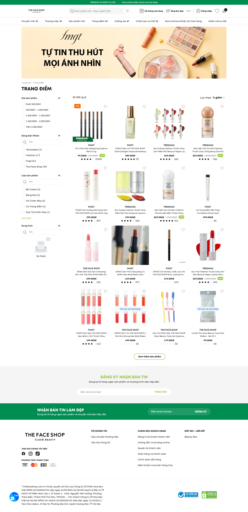
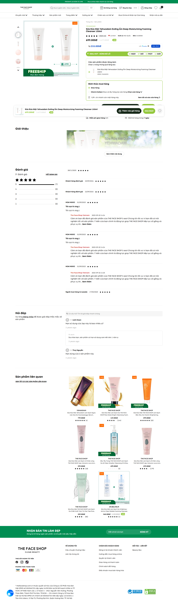
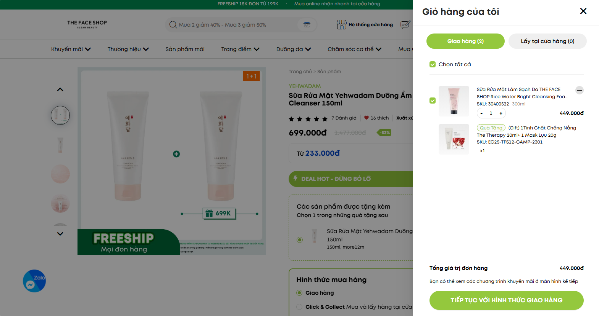

UI Reference

The UI should follow this design:
https://thefaceshop.com.vn/

Important pages to replicate:

- Home page
- Colleciton page
- Product detail page

You must follow the UI of the website
You can mock data to display because i don't completed api yet.

Here UI images:

# Home Page

# Collection Page

# Product Detail Page

# Cart Modal

